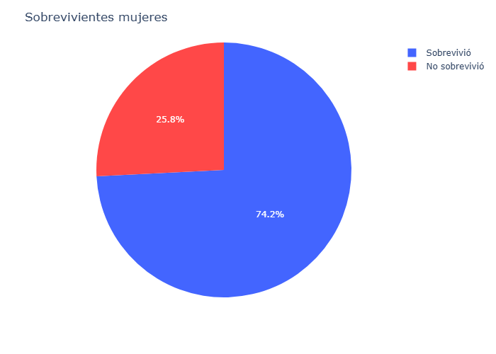
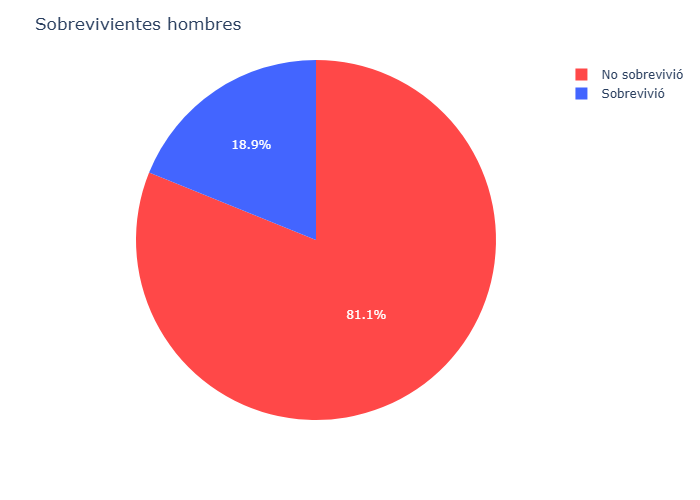
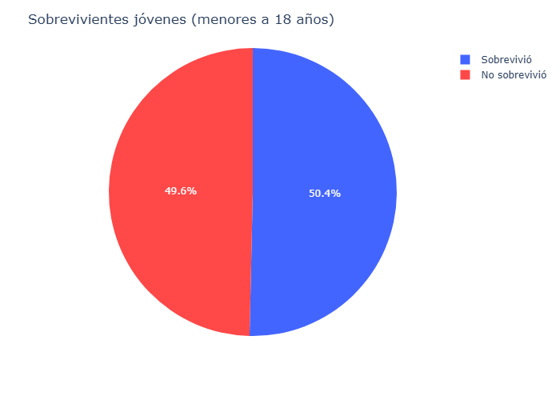
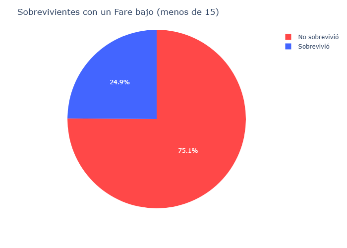
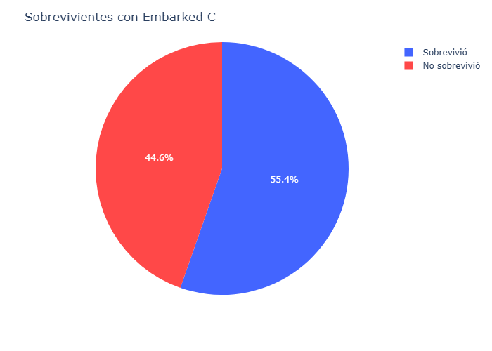

# 🧪 Proyecto predicciones sobrevivientes del Titanic
## ❓ Planteamiento del proyecto
En los datos de los sobrevivientes del Titanic existen ciertas características claves que aumentan o disminuyen las probabilidades de que el pasajero sobreviva al lamentable evento. La idea principal de este proyecto es lograr predecir si un pasajero sobrevive a partir de sus datos.

## ℹ️ Dataset
Recurso: Kaggle

Registros: 891

## 🎯 Objetivos
- Identificar características más influyentes
- Generar modelo de ML predictor de sobrevivientes

## 🧹 Limpieza de datos
- Completar valores faltantes en la edad (Age) con la mediana de los registros
- Eliminar columna de la cabina (Cabin) debido a su pobre cantidad de registros no nulos
- Completar datos faltantes en el lugar de embarcación del pasajero (Embarked) con el valor que mas se repita (moda)
- Completar valores faltantes en el las tarifas (Fare) con la mediana de los registros

## 🔎 EDA
### Sobrevivientes por distintas categorías
Insights:
- El genero femenino sobrevive mucho mas que los hombres

- Ser de un rango de edad "bajo" tiene un poco de implicancia en la posibilidad de sobrevivir

- Tener un precio en la tarifa por debajo de 15 aumenta las probabilidades de no sobrevivir

- Los pasajeros con una Pclass mejor tienden a sobrevivir más

- Los pasajeros embarcados en C (Cherbourg) tiene mas probabiliades de sobrevivencia que los embarcados en otro lugar

## 🤖 ML
### Feature engineering
- Codificar los datos del género en 0 y 1
- Crear columnas en formato One-Hot-Encoding para identificar embarcación
- Crear columna para contar el tamaño de la familia de cada pasajero, además de una segunda columna que indica si el pasajero viaja solo
- Crear columnas en formato One-Hot-Encoding para diferenciando en el título del pasajero
- Balancear los datos debido a que hay varios mas no sobrevivientes con SMOTE

### Modelos utilizados
- Logistic Regression
- Random Forest Classifier

### Métricas calculadas y valores general
Logistic Regression:
- Accuracy: 0.7932960893854749
- Precision: 0.7222222222222222
- Recall: 0.7536231884057971
- F1: 0.7375886524822695
- Cross validation: 0.8204255853367648
- Desviación estándar: 0.023302835425840315

Random Forest Classifier
- Accuracy: 0.821
- Precision: 0.776
- Recall: 0.753
- F1: 0.764
- Cross validation: 0.797
- Desviación estándar: 0.02552156257977987

## Versión de python para el kernel
- Python 3.13.9

## 🏆 Resultados finales
Se encuentran muchas variantes que afectan fuertemente la posibilidad de sobrevivencia de los pasajeros.
Además se considera que el modelo de ML cumple con buenas métricas en su evaluación, esto se traduce en el desarrollo de un modelo funcional y efectivo.

## 👤 Autor
Carlos Rojas