# 🧪 Proyecto predicciones sobrevivientes del Titanic
## ❓ Planteamiento del proyecto
En los datos de los sobrevivientes del Titanic existen ciertas características claves que aumentan o disminuyen las probabilidades de que el pasajero sobreviva al lamentable evento. La idea principal de este proyecto es lograr predecir si un pasajero sobrevive a partir de sus datos.

## 🛠️ Technologies/Tools

- Pandas
- Scikit-learn
- FastApi
- Docker
- Pydantic
- NumPy
- Matplotlib
- Seaborn

## ℹ️ Dataset
Recurso: Kaggle

Link: https://www.kaggle.com/competitions/titanic

Registros: 891

## 🎯 Objectives
- Identificar características más influyentes
- Generar modelo de ML predictor de sobrevivientes

## 🧹 Data cleaning
Los features que son imputados, no se hacen directamente, si no que se harán dentro del Pipeline.

- Age (imputado): Completar nulos con mediana
- Cabin (eliminado): Por tener demasiados nulos, dificil de reconstruir logicamente
- Embarked (imputado): Completar nulos con moda

## 🔎 EDA
Los gráficos que se muestran a continuación se tratan de los principales hallazgos y consideraciónes más importantes, el resto de visualizaciones se pueden encontrar en la carpeta outputs/figures/

### General survival rate
A modo general, dentro de la tragedia del titanic, los pasajeros sobrevivieron en un 38.38%

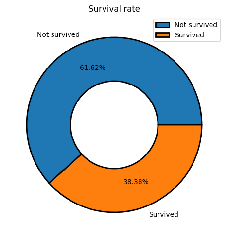

### Pclass
La tasa de supervivencia disminuty progresivamente entre primera, segunda y tercera clase.

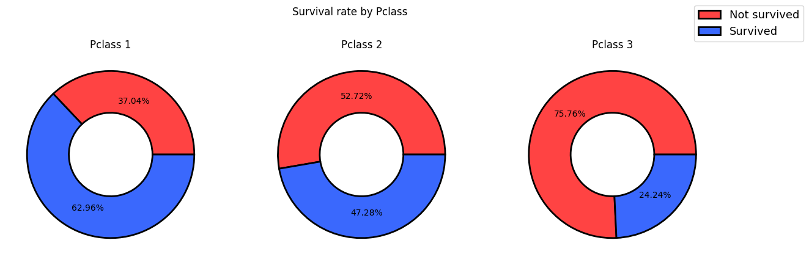

### Sex
La mayoría de las personas abordo del crucero eran hombres. Además los hombres también tiene una tasa de sobrevivencia bastante baja en comparación a las mujeres.

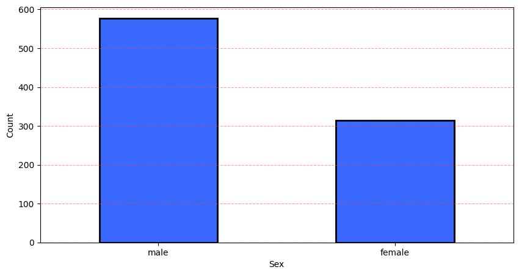

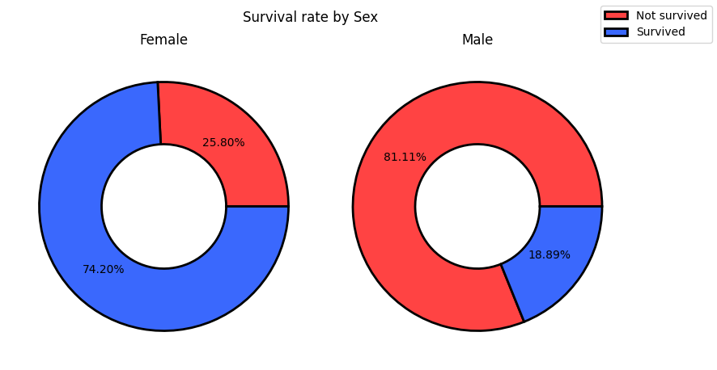

### Age
Los pasajeros a modo general tenian entre unos 15 a 40 años, en cuanto a distribución respecta, en el grupo de sobrevivientes como no sobrevivientes es más común encontrar personas en esas edades, aunque se vuelve más común encontrar personas jóvenes (-10 años) en el grupo de sobrevivientes. Dicho esto, se puede aprecia en el segundo gráfico que las personas entre 0-10 años son las que más probabilidades tienen de sobrevivir.

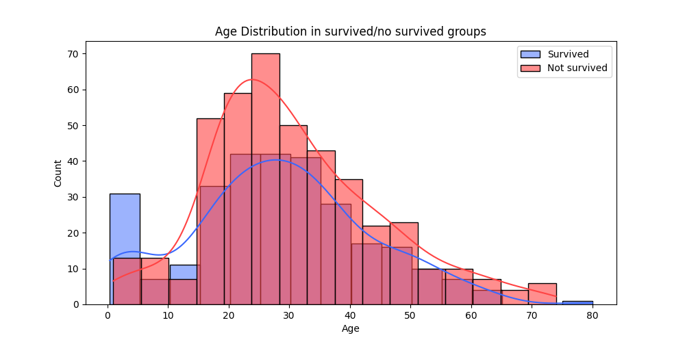

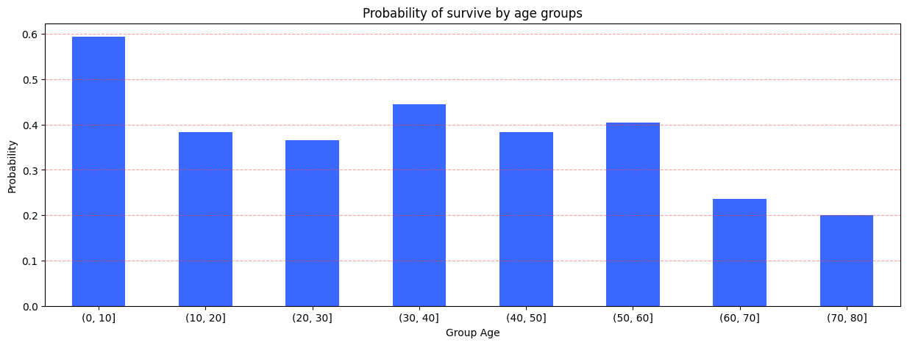

### SibSp
Aparentemente las personas que estaban con 1 hermano/a o esposo/a tenian las posibilidades más altas de sobrevivir, estas posibilidades decrecen con cada vez más acompañantes de este tipo.

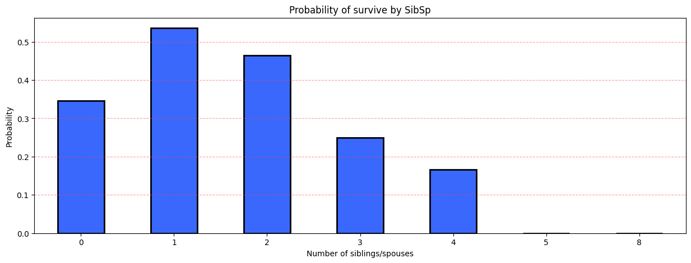

### Parch
En cuanto a padres o hijos, los pasajeros que más sobrevivieron tenian entre 1 a 3 acompañantes de este tipo.

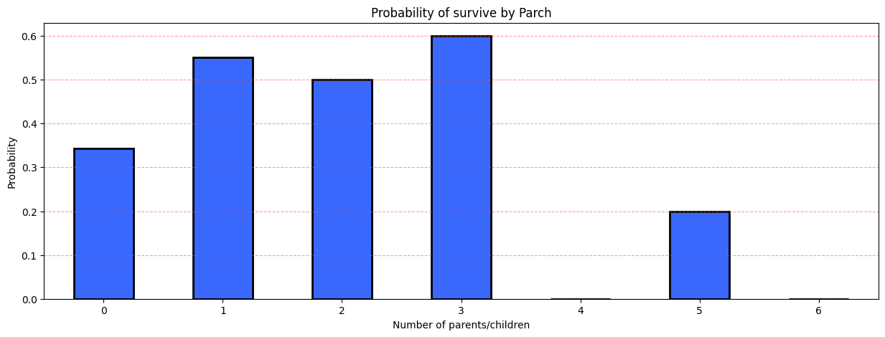

### Fare
La tarifa del ticket de la embarcación parece estar completamente concentrada por debajo de los 50. Además, la segunda visualización nos muestra una pequeña tendencia en donde los sobrevivientes tienden a tener Fare más altos, sin marcar una diferencia tan fuerte. (El segundo gráfico tiene aplicada una transformación logaritmica a Fare para ver de mejor manera la diferencias en grupos, las medidas en el eje "y" no son exactamente transferibles al real fare)

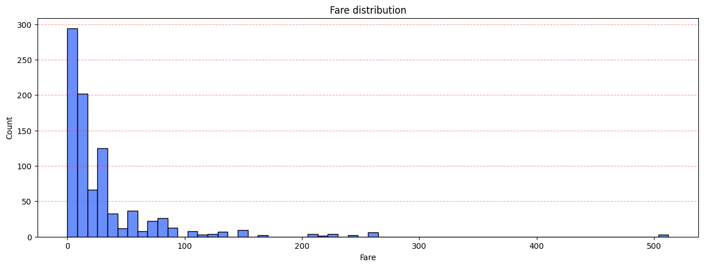

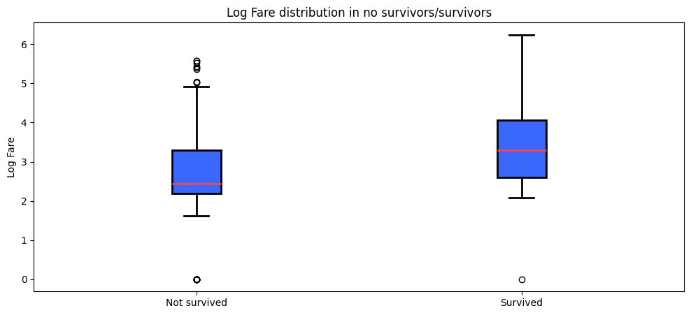

### Embarked
Los pasajeros embarcados en C (Chesbourg) tienen una tasa de supervivencia un poco más alta que los embarcados en Q (Queenstown) y S (Southhampton). Esto puede explicarse debido a que en su mayoría, los embarcados en Chesbourg tienen una Pclass más sofisticada.

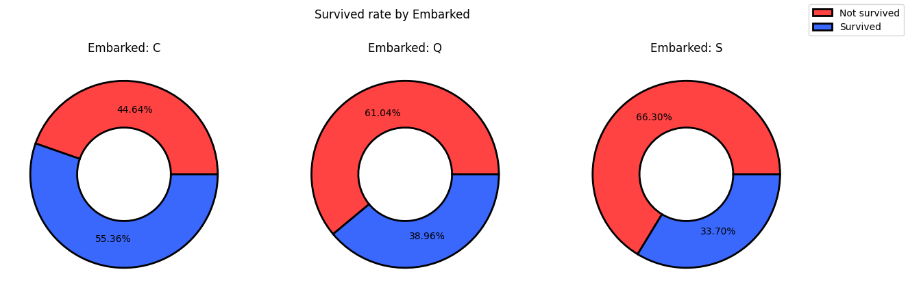

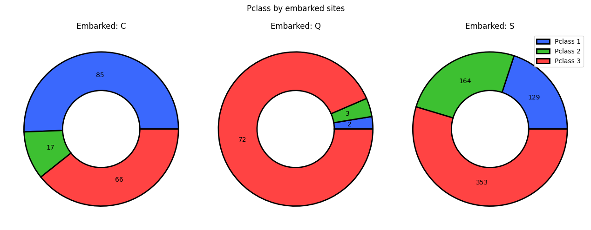

## ⚙️ Preprocess
### Sex
Cambiamos sus valores a binario

Female: 0

Male: 1

### Drop features
Feature que fueron eliminadas porque es difícil que den una señal clara:

- PassengerId
- Ticket
- Name (Es eliminado solo luego de extraer el Title)

### FamilySize
Crear feature FamilySize sumando lo que tenga el registro en SibSp y Parch, finalmente sumandole 1, teniendo el total del grupo de ese registro. Podemos observar la interracción con el target aquí:

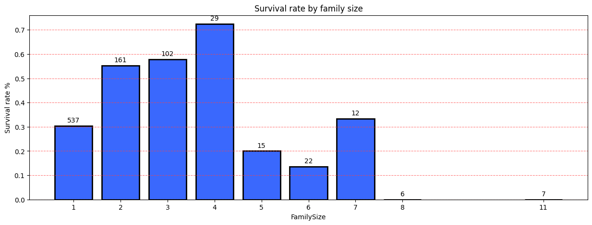

### IsAlone
Gracias a FamilySize podemos obtener el feature IsAlone, que indica si la persona estaba abordo sin acompañantes. Interacción con target:

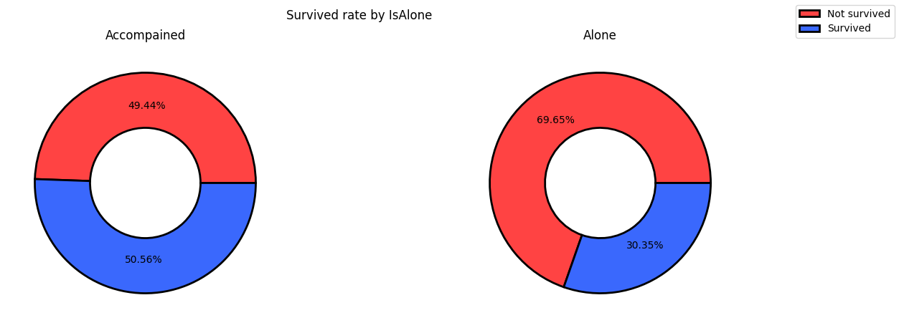

### Title
Feature Title creado a partir del título que está dentro de Name de cada registro. Como por ejemplo: Mr, Miss, etc. Interracción con target:

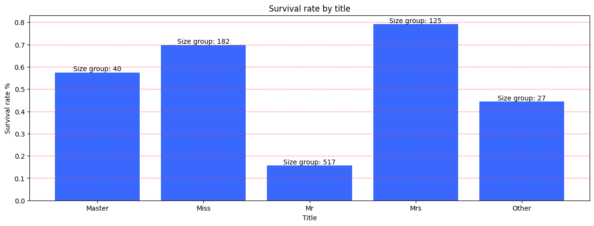

## 🤖 Machine Learning
### Models

Modelos utilizados:

- LogisticRegression
- RandomForestClassifier
- DecisionTreeClassifier
- KNeighborsClassifier
- SVC

### Pipeline
Aquí se creó un pipeline que hace las siguientes actividades:

1. Imputar features numéricas con mediana

2. Imputar features categóricas con moda

3. Aplicar one-hot encoding para variables categóricas

4. Aplicar StandarScaler a features

5. Estimar con modelo seleccionado

### Evaluation in train
Para analizar como es que los distintos modelos aprenden y con qué estabilidad se ha decidido hacer pruebas con StratifiedKFolds para mantener proporciones del target en las pruebas.

Luego se realiza una matriz de confusión con los datos seleccionados para test.

Los resultados son los siguientes:

#### LogisticRegression
Metrics in train:

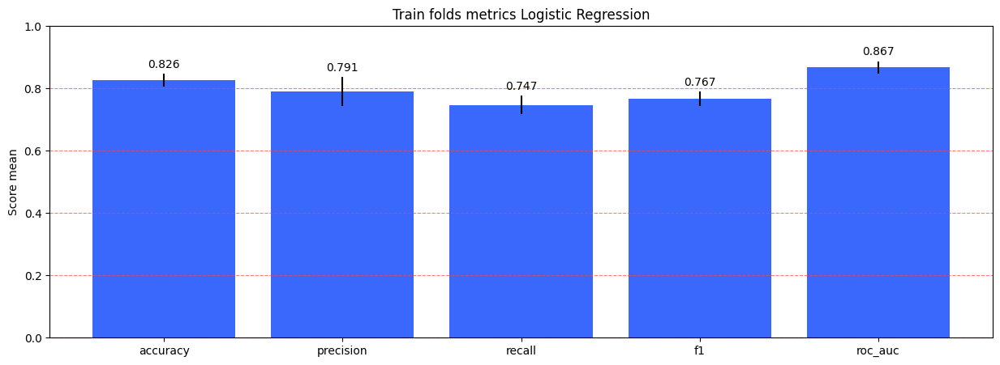

Confusion matrix in test:


#### RandomForestClassifer
Metrics in train:

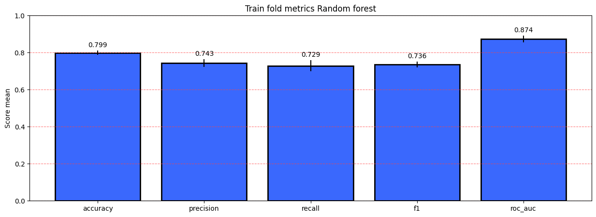

Confusion matrix in test:

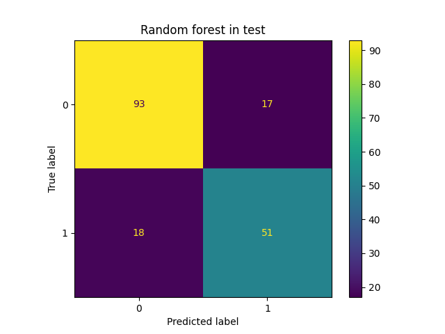

#### DecisionTreeClassifer
Metrics in train:

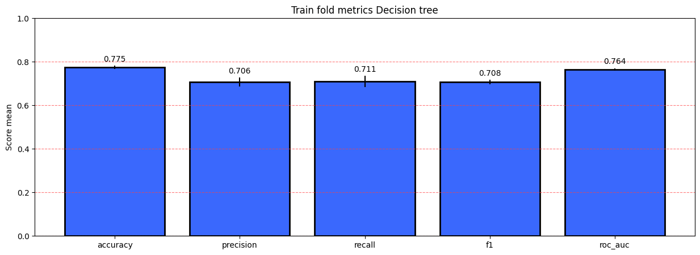

Confusion matrix in test:

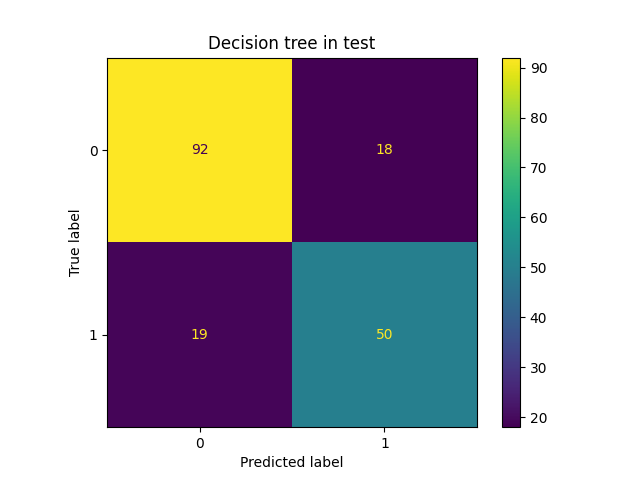

#### KNeighborsClassifier
Metrics in train:

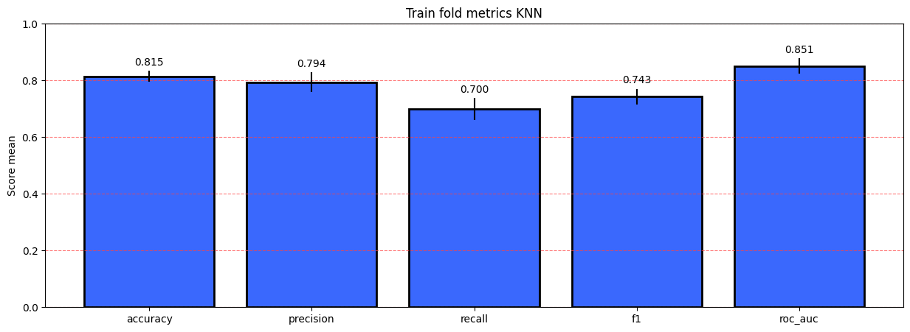

Confusion matrix in test:

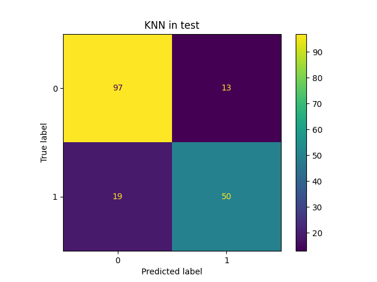

#### SVC
Metrics in train:

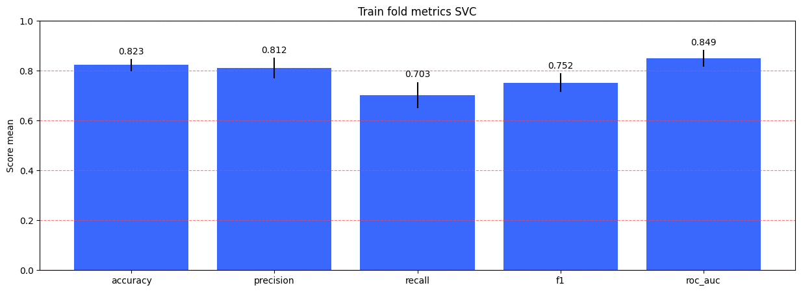

Confusion matrix in test:

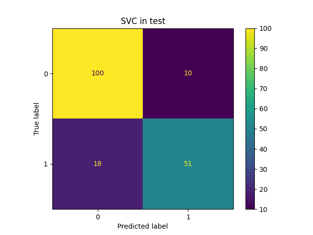

### GridSearchCV
Luego de los procesos anteriores se optó por probar GridSearchCV en los modelos de LogisticRegression y RandomForestClassifier, obteniendo los siguientes resultados.

LogisticRegression:

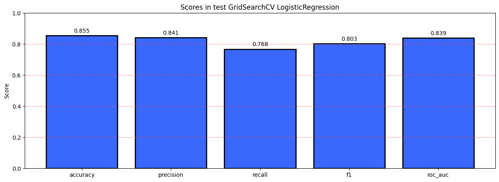

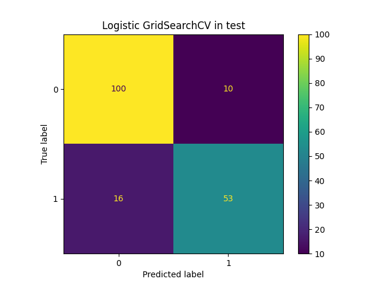


RandomForestClassifier:

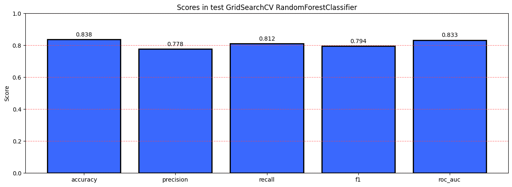

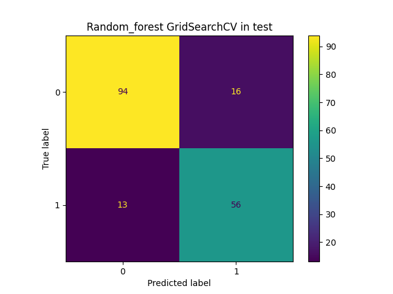

## 🏃 Run project
### API (Docker)
Para poder correr la API predictora de sobrevivientes es necesario hacer lo siguiente:

1. Clonar repositorio

2. Iniciar Docker Desktop

3. PowerShell
Dentro de powershell, dirigirse a la carpeta del proyecto con:

cd "path_de_la_carpeta_del_proyecto"

4. Construir imágen
Ejecutar en powershell:

docker build -t titanic-api .

5. Container
Ahora ejecutar contenedor, para ello en powershell:

docker run --name titanic-api-container -p 8000:8000 titanic-api

6. Realizar predicción
Una vez con el contenedor corriendo, se puede ingresar a http://localhost:8000/docs

Clickear endpoint POST /predict --> Try it out --> Realizar consulta con JSON, ejemplo de JSON:

```
{
  "Pclass": 2,
  "Name": "Allen, Mr. Joao Carlos",
  "Sex": "male",
  "Age": 24,
  "SibSp": 1,
  "Parch": 0,
  "Fare": 50,
  "Embarked": "C"
}
```

Ejemplo de respuesta:

```
{
  "prediction": 0,
  "label": "Not survive"
}
```

### Notebooks y API (manual)
Para poder ejecutar los notebooks hay que hacer lo siguiente:

1. Clonar repositorio

2. Descargar dataset
```
project
├──data/            <-- Crear carpeta
│  ├──clean/        <-- Crear carpeta
│  ├──processed/    <-- Crear carpeta
│  └──raw/          <-- Crear carpeta
│     └──train.csv  <-- Aquí debe ir el dataset
├──app/
├──models/
├──notebooks/
│
...
...
```
3. Crear entorno virtual (recomendado)

En la terminal se debe de estar posicionado dentro del proyecto.

Ejecutar en la terminal: python -m venv venv

Luego: venv/Scripts/activate

En terminal: pip install -r requirements.txt

4. Interpretes

Ahora es necesario seleccionar el interprete y el kernel dentro de los notebooks, para ello ejecutar Ctrl+Shift+P y seleccionar el interprete del entorno virtual. Luego seleccionar el kernel para el notebook, que también debe ser el entorno virtual.

5. API

Para ejecutar la API, luego de instalar las dependencias en un entorno virtual, ejecutar en terminal:

uvicorn app.main:app --reload

Luego de eso se puede ingresar a http://localhost:8000 y http://localhost:8000/docs para probar la API.

Para hacer la prueba de la predicción se debe clickear el boton POST-->Try it out-->Ingresar JSON de prueba en el cuadro, por ejemplo:

```
{
  "Pclass": 3,
  "Name": "Mr. Juan",
  "Sex": "male",
  "Age": 15,
  "SibSp": 1,
  "Parch": 0,
  "Fare": 50,
  "Embarked": "C"
}
```


## 👤 Autor
Carlos Rojas